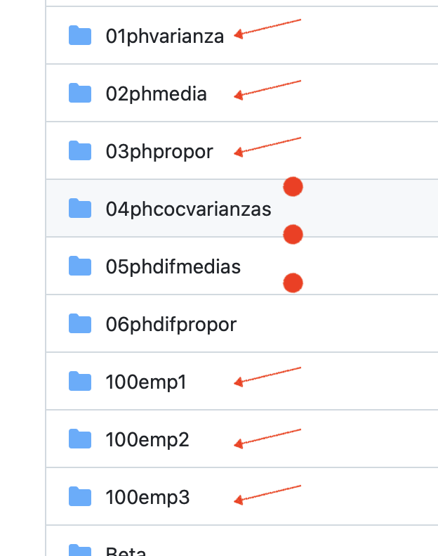

Below you can find Shiny apps to illustrate some statistical concepts.

## Hypothesis testing
- [Test for variance](https://huggingface.co/spaces/FreddyHernandez/ph_varianza)
- [Test for mean](https://huggingface.co/spaces/FreddyHernandez/ph_media)
- [Test for proportion](https://huggingface.co/spaces/FreddyHernandez/ph_proporcion)
- [Test to compare two variances](https://huggingface.co/spaces/FreddyHernandez/ph_cociente_vars)
- [Test to compare two means](https://huggingface.co/spaces/FreddyHernandez/ph_dif_medias)
- [Test to compare two proportions](https://huggingface.co/spaces/FreddyHernandez/ph_dif_proporciones)

## About distributions

- [Plotting a pdf](https://01a0e3a1-f586-ff41-f64e-2c974899502d.share.connect.posit.cloud/)
- [Plotting a pmf](https://01a0e3a3-88cf-3d82-5720-6bb6bf062675.share.connect.posit.cloud/)
- [GLM distributions](https://huggingface.co/spaces/FreddyHernandez/glm_dists/)
- [sample distributions](https://01a0e3b1-79c0-a46a-3d5b-5b1558348da1.share.connect.posit.cloud/)

## Regression modeling

- [Linear regression game](https://01a0e53c-71dd-9f7d-c9a4-7fd5a08b83f7.share.connect.posit.cloud/).
- [Linear mixed model with random intercept](https://huggingface.co/spaces/FreddyHernandez/lmm_b0/)
- [Linear mixed model with random intercept and slope](https://huggingface.co/spaces/FreddyHernandez/lmm_b0b1/)


## Other apps

- [Sample size](https://huggingface.co/spaces/FreddyHernandez/samplesize/)
- [Goodness of fit](https://01a0e3bb-8fec-1f5d-6de5-c500a13730db.share.connect.posit.cloud/)

<br><br>

There are more available shiny apps hosted in this [GitHub repository](https://github.com/fhernanb/semilleroApps). To deploy any app you can run the following R code changing `sub="01phvarianza"` by the app name you want to deploy. 

```{r eval=FALSE}
if (!require("shiny")) install.packages("shiny")
library(shiny)
runGitHub(repo="semilleroApps", 
          user="fhernanb", 
          sub="01phvarianza")
```

The list of all available apps can be [found here](https://github.com/fhernanb/semilleroApps) and correspond to the folder names as shown in the following figure:

<center>{width="30%"}</center>
