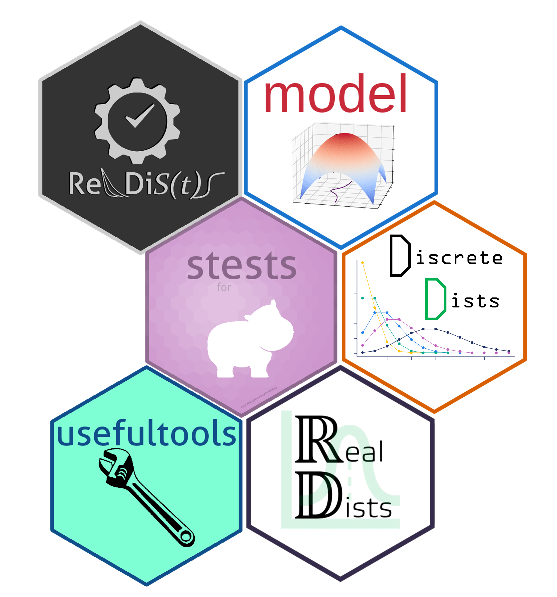

Below, you can find the R packages developed by our team.

- RelDists: [CRAN](https://cran.r-project.org/web/packages/RelDists/index.html), [webpage](https://fhernanb.github.io/RelDists/)
- DiscreteDists: [CRAN](https://cran.r-project.org/web/packages/DiscreteDists/index.html), [webpage](https://fhernanb.github.io/DiscreteDists/)
- ZeroOneDists: [CRAN](https://cran.r-project.org/web/packages/ZeroOneDists/index.html), [webpage](https://fhernanb.github.io/ZeroOneDists/)
- RealDists: [webpage](https://fhernanb.github.io/RealDists/)
- MultivDists: [webpage](https://fhernanb.github.io/MultivDists/)
- stests: [webpage](https://fhernanb.github.io/stests)
- usefultools: [webpage](https://fhernanb.github.io/usefultools/)
- model: [webpage](https://fhernanb.github.io/model/)

{width=75%}

